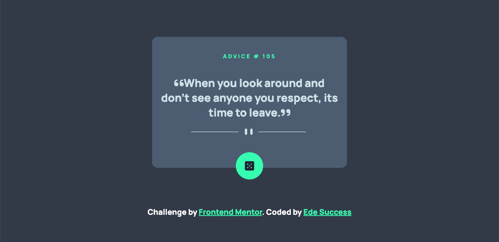

# Frontend Mentor - Advice generator app solution

This is a solution to the [Advice generator app challenge on Frontend Mentor](https://www.frontendmentor.io/challenges/advice-generator-app-QdUG-13db). Frontend Mentor challenges help you improve your coding skills by building realistic projects.

## Table of contents

- [Overview](#overview)
  - [The challenge](#the-challenge)
  - [Screenshot](#screenshot)
  - [Links](#links)
  - [Built with](#built-with)
  - [What I learned](#what-i-learned)
  - [Continued development](#continued-development)
  - [Useful resources](#useful-resources)
- [Author](#author)
- [Acknowledgments](#acknowledgments)

**Note: Delete this note and update the table of contents based on what sections you keep.**

## Overview

### The challenge

Users should be able to:
1. View the optimal layout for the app depending on their device's screen size
2. See hover states for all interactive elements on the page
3. Generate a new piece of advice by clicking the dice icon
- 

### Screenshot

### Links

- Solution URL: [Add solution URL here](https://your-solution-url.com)
- Live Site URL: [Add live site URL here](https://your-live-site-url.com)

### Built with

- Semantic HTML5 markup
- CSS custom properties
- Flexbox
- Mobile-first workflow

### What I learned

during the process of this project, i learnt how to use the css animation property to translate the dice on click

### Continued development
i would love to keep focusing on layout and responsiviness

## Author

- Website - [Ede Success](https://www.your-site.com)
- Frontend Mentor - https://www.frontendmentor.io/profile/edesuccess54
- Twitter - https://www.twitter.com/mansucsex

